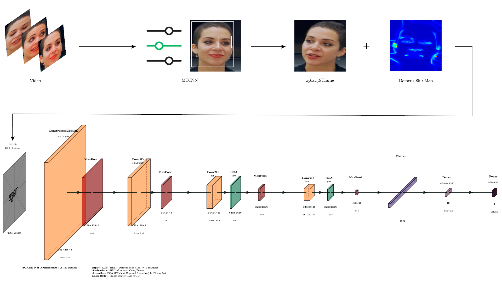
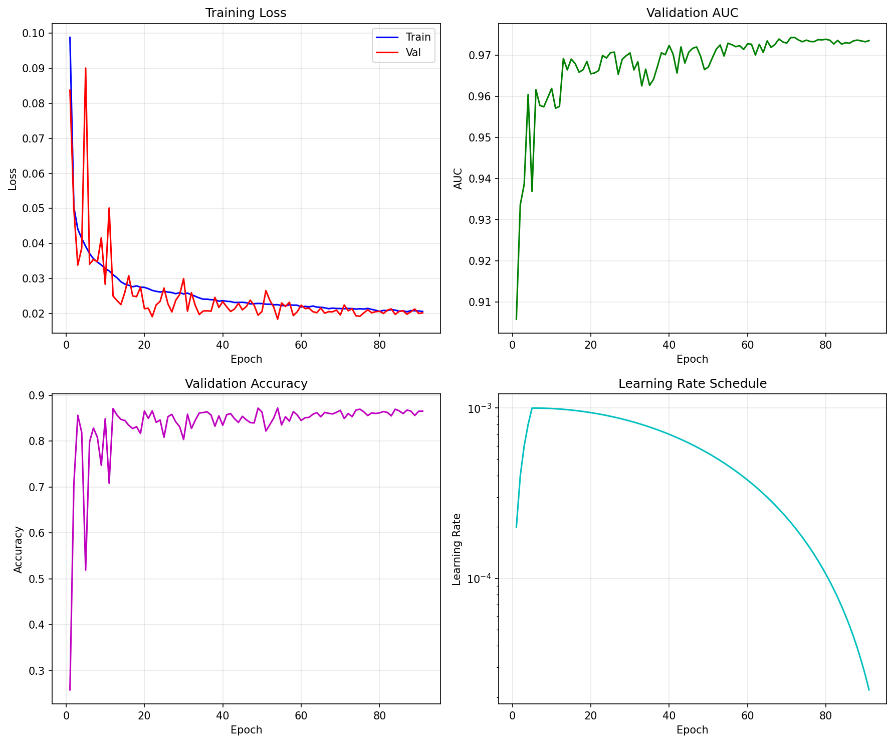
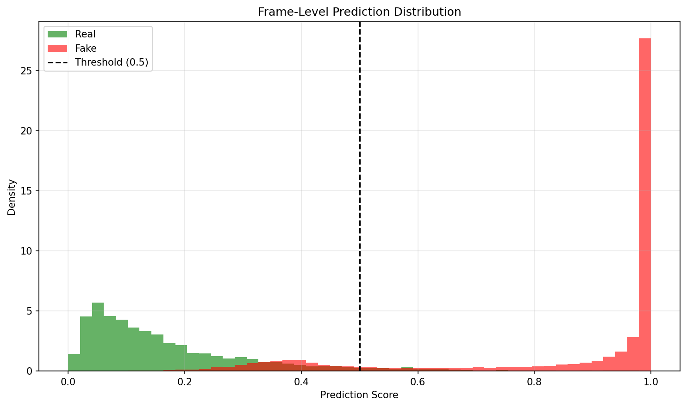
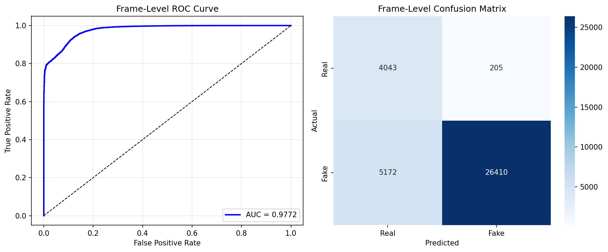

<p align="center">
<h1 align="center"><strong>Single-Center Attention and Defocus-Enhanced Network for Generalized Deepfake Detection</strong></h1>
  <p align="center">
    <a href='https://github.com/vonexel' target='_blank'>Nikolai Mozgovoi </a><sup>∗</sup>&emsp;
    <a href='https://donstu.ru/employees/cherkesova-larisa-vladimirovna' target='_blank'> Larissa Cherckesova </a><sup>&#8224</sup>&emsp;
    <a href='https://github.com/Irina-64' target='_blank'> Irina Trubchik </a><sup>&#8224</sup>&emsp;
    <br>
    <sup></sup> Don State Technical University <sup>
    &emsp;&emsp;
    <br>
    <sup>∗</sup> Contribution&emsp;<sup>&#8224;</sup> Mentorship
    <br>
  </p>
</p>

</p>
<p align="center">
  <a href='https://github.com/vonexel/SCADE-Net'>
    </a>
</p>

---

<div align="center">
  
</div>

---

## 🔬 About  

**SCADE-Net** (Single-Center Attention and Defocus-Enhanced Network) is a compact yet highly effective deep learning architecture designed for face forgery detection with enhanced cross-dataset generalization capabilities. Built upon the foundational Meso-4 architecture, network introduces four strategic improvements that collectively achieve state-of-the-art performance while maintaining an extremely lightweight footprint of approximately **28,113 trainable parameters**.

SCADE-Net integrates four complementary innovations, each addressing specific limitations of conventional approaches:

| Innovation | Component | Purpose | Improvement |
|------------|-----------|---------|-------------|
| **SiLU Activation** | Non-linearity | Smoother gradient flow; mitigates vanishing gradients | +0.5–1.5% Accuracy |
| **Efficient Channel Attention (ECA)** | Attention Module | Adaptive channel-wise feature recalibration with minimal overhead | +1–3% AUC |
| **Defocus Blur Maps** | Input Modality | Physics-based forensic signal capturing depth inconsistencies | +3–5% AUC |
| **Single-Center Loss (SCL)** | Training Objective | Hyperspherical embedding space for enhanced generalization | +5–8% Cross-dataset AUC |

### 🌟 Why These Innovations?

1. **SiLU (Sigmoid Linear Unit)**: Unlike ReLU which produces zero gradients for negative inputs, SiLU provides smooth, non-monotonic gradients that facilitate better optimization in compact networks where gradient signal preservation is crucial.

2. **Efficient Channel Attention**: We deliberately chose ECA over SE-Net due to its parameter efficiency—adding only 3 parameters per attention module versus hundreds in SE blocks—critical for maintaining our sub-30K parameter budget while achieving comparable attention benefits.

3. **Defocus Blur Maps**: Deepfakes exhibit characteristic depth-of-field inconsistencies because the synthesized face region inherits defocus properties from the source rather than target identity. Our defocus map generator exploits this physical anomaly as an additional forensic channel.

4. **Single-Center Loss**: Standard cross-entropy optimizes for discriminative boundaries but may overfit to dataset-specific artifacts. SCL learns a compact hyperspherical representation where real samples cluster around a learnable center, providing inherently better generalization properties.

### Parameter Breakdown

| Component | Parameters | Percentage |
|-----------|------------|------------|
| Block 1 (ConstrainedConv) | 312 | 1.1% |
| Block 2 (Conv) | 1,624 | 5.8% |
| Block 3 (Conv + ECA) | 3,251 | 11.6% |
| Block 4 (Conv + ECA) | 6,451 | 22.9% |
| Classifier (FC layers) | 16,417 | 58.4% |
| SCL Center | 1,024 | 3.6% |
| **Total** | **~28,113** | **100%** |

---

## 📋 News
- 🔥 **January 13, 2026** Code Release

---

## 🛢️ Dataset
SCADE-Net is designed and evaluated on the **DeepFakeDetection (DFD)** subset of the [FaceForensics++ C23](https://arxiv.org/abs/1901.08971) benchmark, utilizing the **c23 (light compression)** quality variant to simulate realistic moderate compression noise, which is common in real-world media.

#### Dataset Statistics

It is imperative to acknowledge that the dataset is distributed under the authors' licensing terms, which impose restrictions on public accessibility, redistribution, and commercial exploitation. For the purposes of this research, we will utilize the DFD dataset, which encompasses 3,068 deepfake videos alongside 364 authentic video sequences. The pronounced class imbalance will be mitigated through the architectural design of our model, which inherently ensures proportional representation and robustness against such data distribution challenges.

### Preprocessing Methodology

The preprocessing pipeline transforms raw video data into training-ready samples through four stages:

```
Raw Video → Frame Extraction → Face Detection → Defocus Generation → RGBD Output
```

#### 1. Frame Extraction
- **Sampling strategy**: 1 frame per 10 video frames (configurable)
- **Maximum frames**: 100 per video (configurable)
- **Format preservation**: Maintains temporal diversity while managing dataset size

#### 2. Face Detection and Alignment
- **Detector**: MTCNN (Multi-task Cascaded Convolutional Networks) [[4]](#references)
- **Face size**: 256×256 pixels
- **Margin**: 30% expansion around detected bounding box
- **Alignment**: 5-point landmark-based affine transformation
- **Fallback**: OpenCV Haar cascade for edge cases

#### 3. Defocus Blur Map Generation
- **Method**: Edge-aware guided filter propagation
- **Output**: Single-channel float32 map normalized to [0, 1]
- **Processing time**: ~90ms/image (CPU), ~30ms/image (GPU with OpenCV CUDA)

#### 4. Data Organization
```
preprocessed/
├── face_crops/
│   ├── real/
│   │   └── {video_name}/
│   │       └── frame_{XXXXXX}.jpg
│   └── fake/
│       └── {video_name}/
│           └── frame_{XXXXXX}.jpg
├── defocus_maps/
│   ├── real/
│   │   └── {video_name}/
│   │       └── frame_{XXXXXX}.npy
│   └── fake/
│       └── {video_name}/
│           └── frame_{XXXXXX}.npy
├── metadata.json                 # Processing statistics
└── splits.json                   # Video-level train/val/test assignments
```

**Critical Note**: Data splitting is performed at the **video level** to prevent identity leakage—frames from the same video never appear in different splits.

---

## Usage
- Python 3.9+ (tested with 3.9)
- CUDA 11.8+ (recommended for GPU training)
- 8GB+ GPU memory (for training)

### 🐍 Setup with uv

[uv](https://github.com/astral-sh/uv) is a fast Python package manager. Install it first:

```bash
# Install uv (Linux/macOS)
curl -LsSf https://astral.sh/uv/install.sh | sh

# Or with pip
pip install uv
```

### 🚀 Getting Started

```bash
# Clone repository
git clone https://github.com/vonexel/SCADE-Net.git

# Go to repository directory
cd SCADE-Net

# Create virtual environment with uv
uv venv --python 3.11

# Activate environment
source .venv/bin/activate  # Linux/macOS
# or
.venv\Scripts\activate     # Windows

# Install dependencies
uv pip install -r requirements.txt

# Install project in editable mode
uv pip install -e .
```

### Data Download and Preprocessing

#### 📥 Download FaceForensics++ DFD Dataset

Request access and download from the official source:
- **URL**: https://github.com/ondyari/FaceForensics
- **Dataset**: DeepFakeDetection (DFD)
- **Quality**: c23 (light compression)

Organize downloaded videos as follows:
```bash
mkdir -p dataset/real dataset/fake

# Move original videos to real/
mv path/to/original_sequences/*.mp4 dataset/real/

# Move manipulated videos to fake/
mv path/to/manipulated_sequences/DeepFakeDetection/*.mp4 dataset/fake/
```

#### 🛠️ Preprocess Dataset
```bash
# Full preprocessing with defocus blur maps
uv run preprocess.py \
    --dataset ./dataset \
    --output ./preprocessed \
    --max-frames 100 \
    --sampling-rate 10 \
    --val-split 0.15 \
    --test-split 0.15

# Quick preprocessing (skip defocus for testing)
uv run preprocess.py \
    --dataset ./dataset \
    --output ./preprocessed \
    --no-defocus
```

### 🏋️‍♂️ Model Training

```bash
# Basic Training
uv run train.py \
    --data ./preprocessed \
    --output ./outputs \
    --epochs 50 \
    --batch-size 75 \
    --lr 0.001 \
    --scl-lambda 0.1

# Train with custom config
uv run train.py --config my_config.yaml --data ./preprocessed
```

#### 🔄 Resume Training from Checkpoint

```bash
uv run train.py \
    --data ./preprocessed \
    --output ./outputs \
    --resume ./outputs/checkpoint_epoch_25.pth
```

### ⚡ Inference

#### 🖼️ Single Image Inference

```bash
uv run inference.py \
    --model ./outputs/best_model.pth \
    --image ./test_face.jpg \
    --threshold 0.5
```

#### 🎞️ Video Inference

```bash
uv run inference.py \
    --model ./outputs/best_model.pth \
    --video ./test_video.mp4 \
    --max-frames 20 \
    --threshold 0.5
```

#### 🗃️ Batch Directory Processing

```bash
uv run inference.py \
    --model ./outputs/best_model.pth \
    --input ./test_data/ \
    --output results.json
```

### 🎨 Visualization

#### ⿻ Streamlit Web Application

```bash
# Start the web interface
streamlit run app.py
```

**Features**:
- Drag-and-drop image/video upload
- Real-time face detection and analysis
- Interactive Grad-CAM visualization
- Defocus map visualization
- Downloadable analysis reports

#### 📜 Command-Line Visualization

```bash
# Visualize predictions on a batch of images
uv run visualize_prediction.py \
    --model ./outputs/best_model.pth \
    --input ./test_images/ \
    --output ./visualizations/
```

---

## 📦 Checkpoint

| 🏷️ Model                                 | 🔗 Link                         |
|--------------------------------------|------------------------------|
| `SCADE-Net`  | [Best model](./outputs/best_model.pth) |

## 📊 Results

### Training and Validation Results:

|             Training History             |             Prediction Distribution             |             Evaluation Results             | 
|:----------------------------------------:|:-----------------------------------------------:|:------------------------------------------:|
|  |  |  | 


### Test Results
The best results are highlighted in <ins>underline</ins>.

| Metrics                 | Meso-4          | SCADE-Net | 
|-------------------------|-----------------|-----------|
| Trainable Parameters               | **<ins>27,977</ins>** | 28,113    | 
| DFD AUC                 | 0.945           | **<ins>0.977</ins>** | 
| Cross-Dataset (F2F AUC) | 0.946           | **<ins>0.963</ins>** | 
| Inference  (ms)         | **<ins>1</ins>**           | **<ins>1</ins>**     |

---

## 📚 References 
1. **Afchar, D., Nozick, V., Yamagishi, J., & Echizen, I.** (2018). MesoNet: a Compact Facial Video Forgery Detection Network. *IEEE International Workshop on Information Forensics and Security (WIFS)*. [[arXiv:1809.00888]](https://arxiv.org/abs/1809.00888)
2. **Wang, Q., Wu, B., Zhu, P., Li, P., Zuo, W., & Hu, Q.** (2020). ECA-Net: Efficient Channel Attention for Deep Convolutional Neural Networks. *IEEE/CVF Conference on Computer Vision and Pattern Recognition (CVPR)*. [[arXiv:1910.03151]](https://arxiv.org/abs/1910.03151)
3. **Rossler, A., Cozzolino, D., Verdoliva, L., Riess, C., Thies, J., & Niessner, M.** (2019). FaceForensics++: Learning to Detect Manipulated Facial Images. *IEEE/CVF International Conference on Computer Vision (ICCV)*. [[arXiv:1901.08971]](https://arxiv.org/abs/1901.08971)
4. **Zhang, K., Zhang, Z., Li, Z., & Qiao, Y.** (2016). Joint Face Detection and Alignment Using Multitask Cascaded Convolutional Networks. *IEEE Signal Processing Letters*. [[arXiv:1604.02878]](https://arxiv.org/abs/1604.02878)
5. **Bayar, B., & Stamm, M. C.** (2018). Constrained Convolutional Neural Networks: A New Approach Towards General Purpose Image Manipulation Detection. *IEEE Transactions on Information Forensics and Security*. [[IEEE]](https://ieeexplore.ieee.org/document/8335799)
6. **Jeon, M., & Woo, S. S** (2025). Seeing Through the Blur: Unlocking Defocus Maps for Deepfake Detection. *Proceedings of the 34th ACM International Conference on Information and Knowledge Management*. [[arXiv:2509.23289]](https://arxiv.org/abs/2509.23289)
7. **Li, L., Bao, J., Zhang, T., Yang, H., Chen, D., Wen, F., & Guo, B.** (2021). Frequency-aware Discriminative Feature Learning Supervised by Single-Center Loss for Face Forgery Detection. *IEEE/CVF Conference on Computer Vision and Pattern Recognition (CVPR)*. [[arXiv:2103.09096]](https://arxiv.org/abs/2103.09096)

## 🤝 Acknowledgment

This project builds on the insights of many researchers in media forensics and deep learning. We express our gratitude to **Darius Afchar et al.** for the MesoNet architecture that inspired our base model, and to **B. Bayar & M. Stamm** for the constrained conv layer concept. We thank **Banggu Wu et al.** for open-sourcing ECA-Net, and **Y. Li et al.** for developing the Single-Center Loss strategy. The idea to leverage defocus cues came from the work of **H. Chen et al.**, which added a new dimension to deepfake detection – we appreciate their groundbreaking research. We are also grateful to the maintainers of **FaceForensics++** (Andreas Rössler and colleagues) and **Google/Jigsaw** for providing the deepfake datasets that enabled our experiments.

## ⚖️ License
This project is licensed under the **MIT License** - see the [LICENSE](LICENSE) file for details.

Note that this project utilizes FaceForensics++ datasets under research-only terms, prohibiting commercial use or redistribution, and requires adherence to both dataset-specific licenses and the license for the code.

## ✏️ Citation

If you think this project is helpful, please feel free to leave a star ⭐️ and cite it by using the following BibTeX entry:

```
@Misc{SCADE-Net,
  title =        {Single-Center Attention and Defocus-Enhanced Network for Generalized Deepfake Detection},
  author =       {Nikolai Mozgovoi, Larissa Cherckesova, Irina Trubchik},
  howpublished = {\url{https://github.com/vonexel/SCADE-Net}},
  year =         {2026}
}
```

If you use the FaceForensics++ dataset, please also cite:

```bibtex
@inproceedings{rossler2019faceforensics,
  title={FaceForensics++: Learning to Detect Manipulated Facial Images},
  author={Rossler, Andreas and Cozzolino, Davide and Verdoliva, Luisa and Riess, Christian and Thies, Justus and Niessner, Matthias},
  booktitle={IEEE/CVF International Conference on Computer Vision (ICCV)},
  year={2019}
}
```

## 📬 Contact
If you have any questions related to the code or the paper, feel free to email Nikolai Mozgovoi (`nmozgovoi@outlook.com`).

---

<p align="center">
  <i>For issues, or contributions, please open an issue on GitHub.</i>
</p>